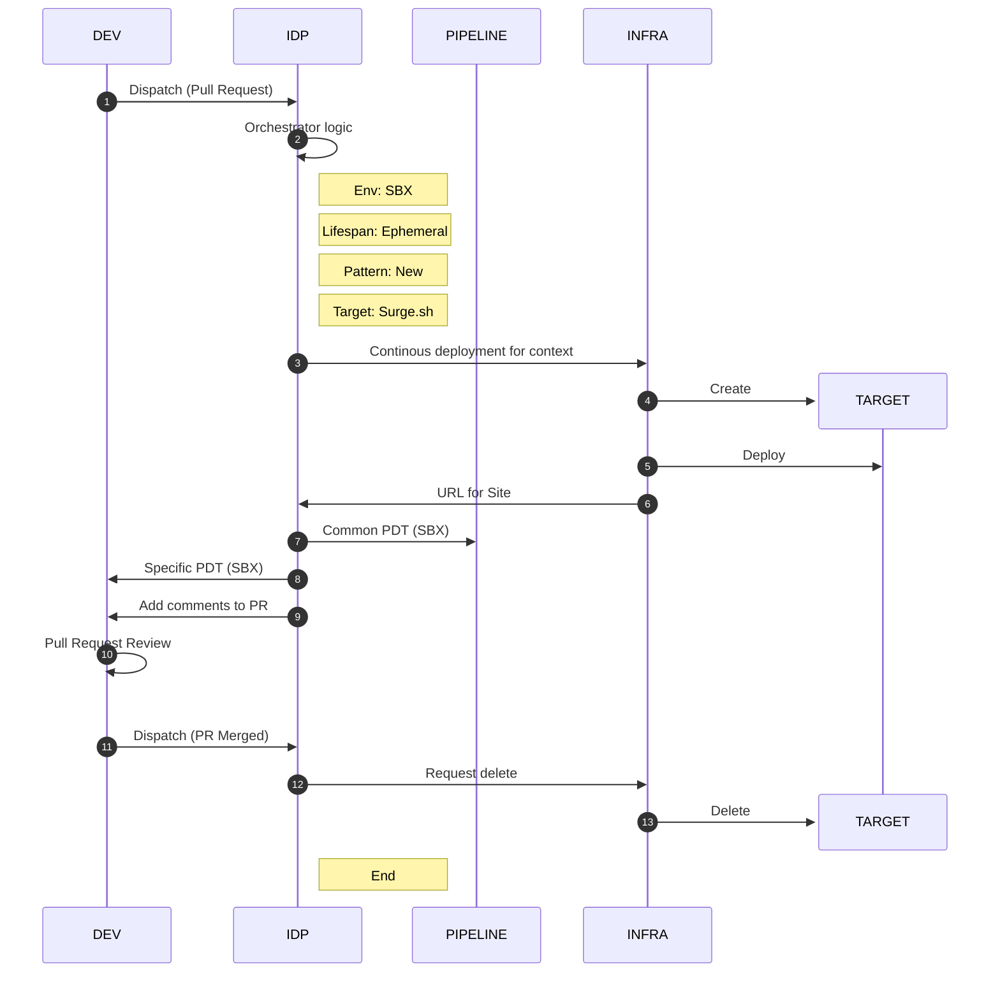
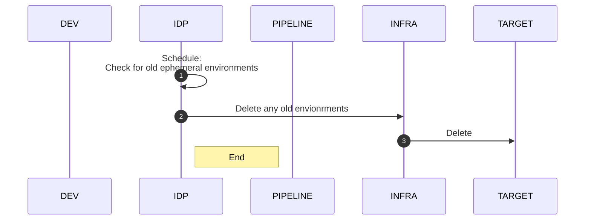
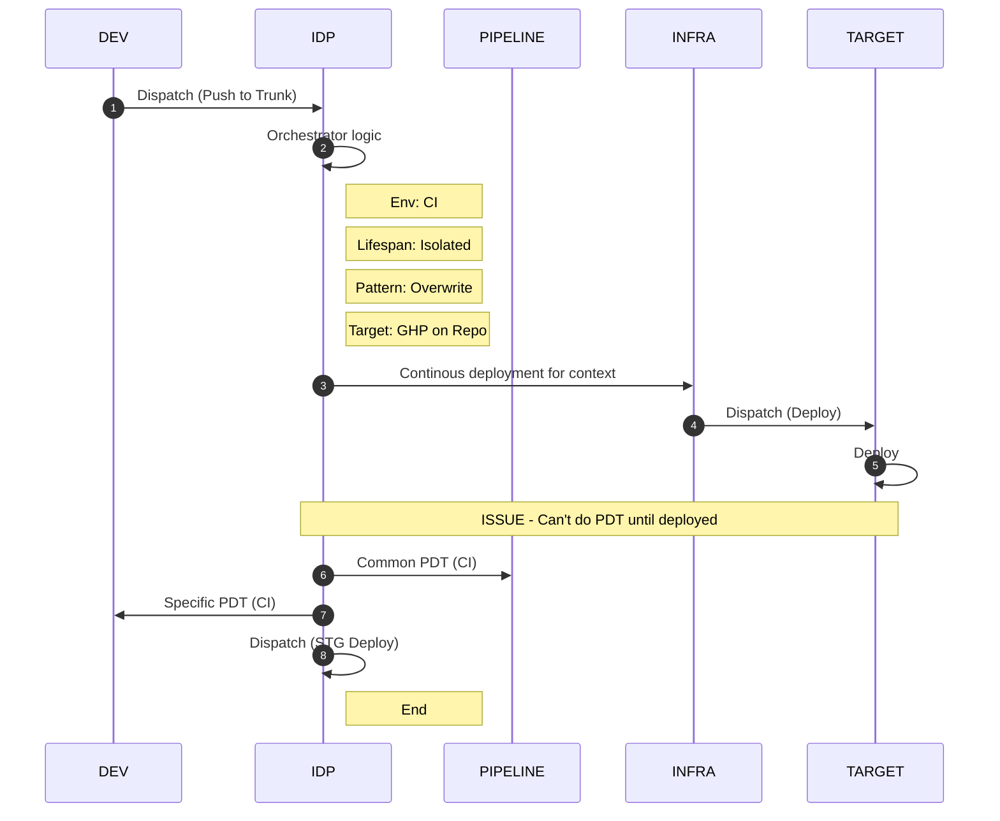
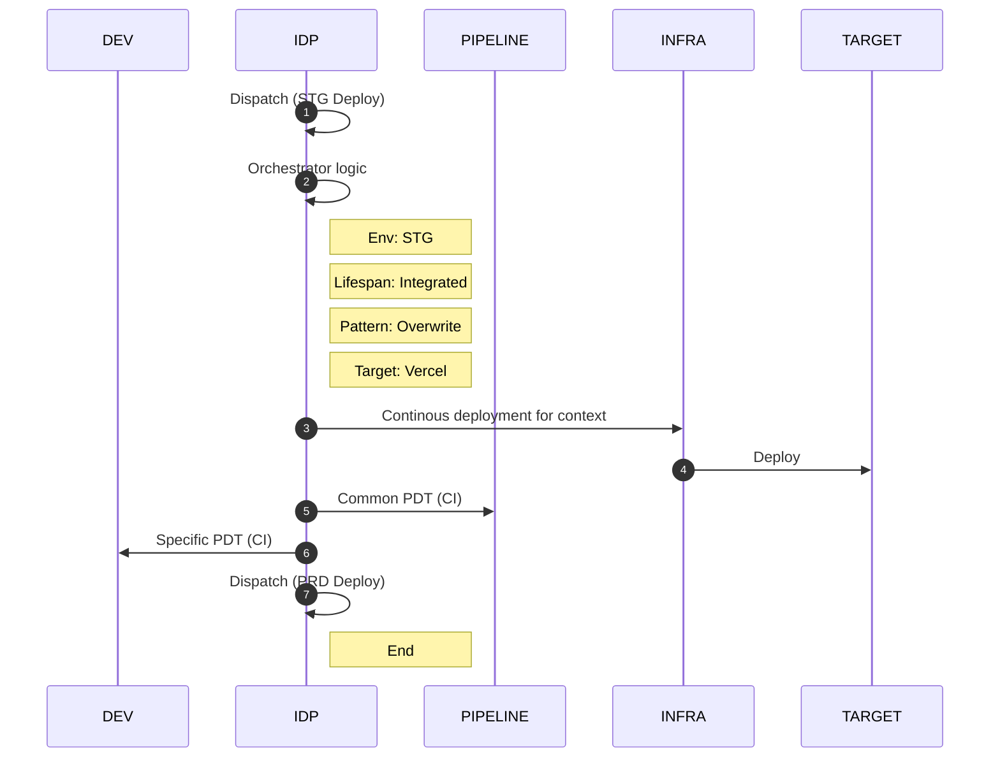

# Static Site : Deployments

---

## Workflow: Pull Request Ready for Review

---

## Workflow: Clean up ephemeral environments

---

## Workflow: Commit/merge to trunk

---

## Workflow: Dispatch for STG deployment

---

## Workflow: Blue/green deployments for PRD

